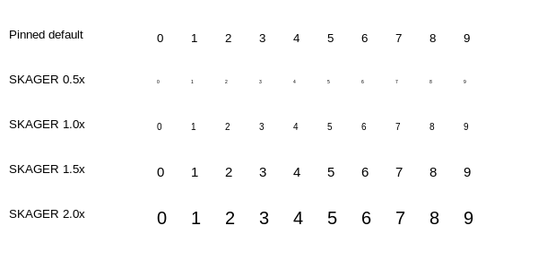

# SCRUM-249 — sounding digit typography

The final immutable `.chart-depth` rule in `docs/design/prototype/src/style.css`
is 10px, inheriting `"Segoe UI Variable Display","Segoe UI",Arial,sans-serif`
and normal weight. The earlier 9px declaration is overridden. This increment
maps that em size to 7.5 fractional points at 96 DPI. It does not copy the
prototype sample depths, decorative opacity or a single color for every depth.

`CreateChartPresentation` installs `ChartSoundingFont` only after the requested
SKAGER library has verified resources and loaded successfully. The stock library
constructors used by Standard, Legacy, Safe and fallback receive no callback.
The S52 owner retains the returned font by value. `DepthFont` copies it; no UI or
Vessel Data object retains a chart pointer, and FontMgr settings are not changed.

The callback applies the existing sounding preference in its pinned 0.5–2 range
and the separate upstream content scale once. wx retains native display-DPI
handling. The cache is local to the S52 owner and is invalidated on sounding
preference, content-scale or DIP-factor change. Every digit reuses the same font
and atlas until then. Software and GL use the same fractional-size font; a new
optional `DepthFont::Build` parameter bypasses only the legacy integer-point
conversion/rescaling. Existing callers default to the unchanged stock path.

The entire actual `RenderSoundingSymbol` tail after font selection is identical
to the pinned source: digit/pivot groups, geographic anchor, bounding calculations,
rotation, GL color/opacity and software digit draw remain unchanged. The complete
`RenderMPS` method is also unchanged, including value/rule selection, visibility,
safety/deep SNDG1/SNDG2 colors, drying HPGL marks and the SOUNDGC2 uncertainty
raster bypass. Symbolized soundings on other objects still use their stock
raster path; this is specifically the shared multipoint sounding digit font.
Changing digit dimensions naturally changes the existing metric-based pivot
spacing; no pivot formula, rule, decimal grouping or geographic coordinate is
rewritten.

Validation uses verbatim prepared `RenderSoundingSymbol` and all actual
`DepthFont` methods, real wx font metrics/rasterization and recorded GL uploads.
**132,403 assertions pass** over 40 combinations of four DIP factors, two content
scales and five sounding preferences, all ten digits and six pivot groups. Every
atlas digit pixel matches an independent native raster. Checks cover exact
prototype size, normal weight, preserved caller ink, unchanged pinned pivot
formula, font/atlas reuse, deletion and rebuild on all three scale inputs.
Source guards prove the stock font branch and semantic methods are unchanged,
and installation occurs only inside the verified library success path.
Restoring legacy atlas rounding is rejected by the negative control.

All six affected production objects compile individually: ChartPresentation,
s52plib and DepthFont, each with software and GL definitions. Existing upstream
`strncpy` diagnostics remain visible. An initial compile found the new setter
placed in a private section; it was moved to the public API and all objects
then passed. Initial fixture setup also corrected an unnecessary forward
redeclared typedef and added the real bbox implementation to its link inputs.
All nine integration patches verify against the pinned source.

The image is a Linux native digit fixture, not ENC data or release evidence.
GL calls capture uploads, not driver rendering; viewport coordinates and the
S52 owner are bounded fixture scaffolding. The stock GL/software baseline/pivot
conventions remain upstream and are not claimed pixel-identical. Native Windows
font fallback/DPI, actual GL draw, real ENC comparison and boat readability
remain mandatory acceptance gates under SCRUM-15. No CI or boat run occurred.

Reproduce the focused fixture with `tools/verify-chart-sounding.py --source
build/integration-source --output <private-output> --wx-config <wx-config>
--wx-prefix <prefix>` under a native display. Add `--negative-legacy-rounding`
for the deliberately failing regression control. Evidence is in
`docs/evidence/scrum249-sounding/`.
