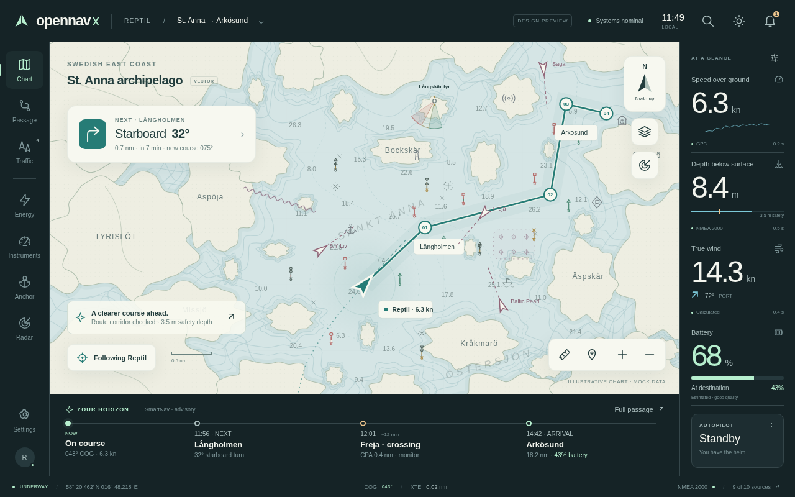
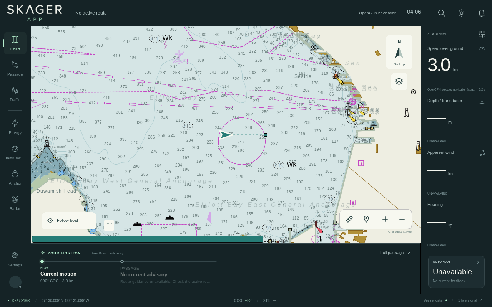
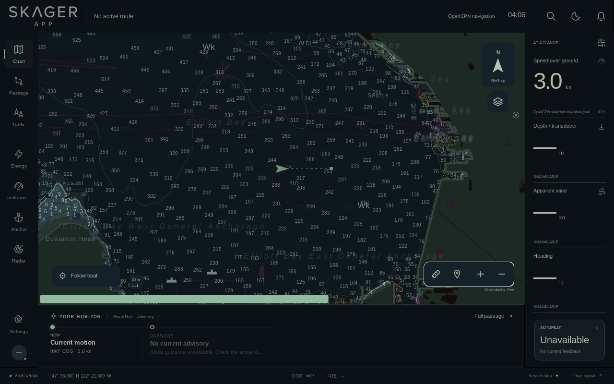
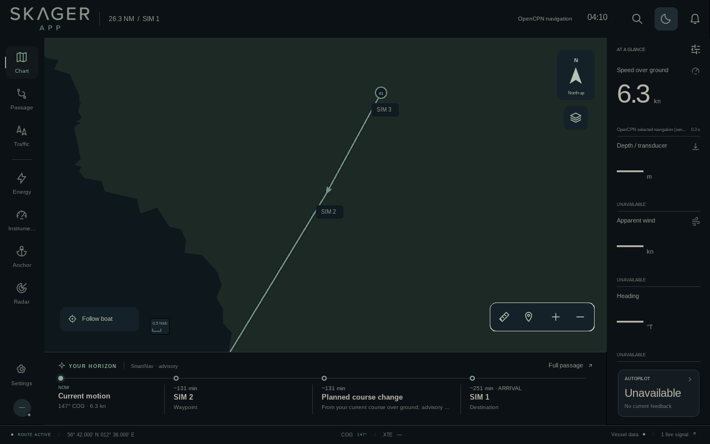

# SKAGER chart comparison — 78eccb8

This is a visual review of the frozen application source
`78eccb8b7f21b260ded57d3ba763f884d60c8180`, published as
`61a0a7838b56ad841bb458af6fc62651464bdafe`. It is not a declaration of full
prototype conformance. Native Windows and boat-display acceptance remain open.

## Day composition

The original HTML uses illustrative Swedish geography. The native view below
uses the public NOAA Seattle ENC, with its actual soundings, restrictions,
lights and hazards. Different geographic content must not be erased to improve
an image comparison. The chart occupies the same `(80,68)–(1094,634)` rectangle.

**Immutable prototype:**

**Current native SKAGER, software renderer:**

The customer-facing SKAGER name and Jira-approved wordmark intentionally replace
the prototype's temporary identity. Actual data and unavailable fields remain
truthful. No illustrative battery, wind or route values have been inserted.

## Night chart and labels

Night water and land use the effective prototype colors after its chart-only
brightness rule. Floating UI surfaces remain separately themed. Safety ink,
soundings and conditional danger symbols retain their navigation-readability
requirements; there is no blanket dark overlay over the chart.

The active-waypoint name is now readable in its prototype card. Its upstream
active icon and blinking remain distinct from inactive numbered waypoints.
This controlled route view verifies real OpenCPN route processing; it is a
separate test scene, not the NOAA ENC or a real boat route.

## What this revision establishes

| Presentation | Evidence and boundary |
|---|---|
| Water, land and built-up areas | Exact derived Day/Dusk/Night roles; software and actual Mesa GL comparisons. |
| Route line and name cards | Original route assertions, exact foreground/understroke and card samples; four hot themes; active icon on/off phases. |
| Cardinal and service artwork | Prototype-derived classified glyphs; pinned native resource-loader proof. The NOAA test chart contains no cardinal objects, so actual ENC cardinal recognition remains open. |
| SKAGER identity | Approved source artwork and Windows resource wiring; matte-free native logo in all three themes. Final Windows executable/icon appearance remains to be reviewed. |
| Standard fallback | All final Standard chart rectangles remain pixel-identical to the retained baseline. |

## Visible differences still requiring review

- The real harbor chart is denser than the illustrative map. Labels, light
  descriptions and chart soundings must remain legible without hiding required
  navigation information. Linux fallback fonts do not qualify Windows typography.
- The chart-selection strip remains an OpenCPN control with SKAGER palette
  treatment. Its geometry is not defined by the prototype.
- Conditional hazards, some generic or ambiguous mark classes, custom symbols,
  selected/edited marks and special navigation states retain upstream treatment
  where the prototype does not establish equivalent meaning. The
  [symbol-boundary audit](scrum15-symbol-source-audit.md) records the specific
  mappings; this is not a claim that every symbol now matches.
- Actual Windows fonts/DPI, the boat GPU, physical display and touch behavior
  are acceptance gates. Mesa llvmpipe proves execution of the GL path only.

All original screenshots and failure records remain available in the
[ENC evidence](../../evidence/skager-product-fidelity-78eccb8-linux/README.md)
and [route evidence](scrum252-257-final-78eccb8.md). The exact candidate is in
[full qualification run 37088759582](https://github.com/ThereptileII/Work/actions/runs/37088759582).
Jira SCRUM-14/15/235 and their bounded implementation issues remain authoritative
for acceptance; this review is evidence, not a separate backlog.
