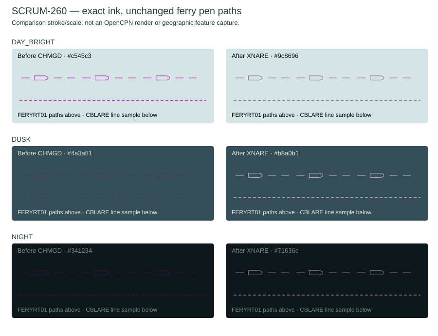

# SCRUM-260: bounded ferry and cable-area ink

Base: `18678cd6b6386381b0a08e13c7264ff1a3693460`. This changes two exact paint references in the derived SKAGER resource set. It does not change the pinned stock resources or chart preferences.

The earlier real US5SEAFL feature audit identifies the cross-bay cable area as CBLARE RCID 1566 (restrictions 2, 6, 24), and the ferry route as FERYRT RCID 3032, CATFRY 1. The pinned presentation lookup for that ferry category is id 745 / RCID 31821, `LC(FERYRT01)`. The source audit is retained in [the cable-paint evidence](../scrum251-cable-paint/real-enc-audit.json).

## Exact mapping

| Pinned node | Only changed paint | Preserved behavior |
| --- | --- | --- |
| Line style FERYRT01, RCID 2019 | `ACHMGD` → `AXNARE` | Complete HPGL, SW1, dimensions, pivot, spacing and every ferry lookup |
| Plain Area CBLARE lookup id 25, RCID 32061 | `LS(DASH,2,CHMGD)` → `LS(DASH,2,XNARE)` | `SY(CBLARE51)`, dash style, width 2, `CS(RESTRN01)`, attributes and ordering |

`XNARE` is a new owned role because the existing `XNCBL` contract is specifically submarine-cable paint. Both resolve to the immutable prototype's final `--mark-area` hue. The final marker palette and `chartMarkerTone` assign this hue to area/line/pattern artwork. This deliberately retains the classified S52 ferry pen paths rather than replacing them with illustrative HTML line geometry.

| Theme | Effective XNARE |
| --- | --- |
| Day | `#9c8696` |
| Dusk | `#b8a0b1` |
| Night | `#71636e` (raw `#917f8d`, chart brightness `.78` applied once) |

Global `CHMGD`, FERYRT02, Symbolized CBLARE lookup id 365 / RCID 32400, CBLARE51 line style, dumping grounds, conditional restricted-area rules, every chromatic navigation symbol, all bitmap pixels and Standard/Legacy remain unchanged. There is no opacity change.

## Focused proof

- One production generation from pinned OpenCPN `37fd0cddb7334fe489e9f18aa163977a9c5c84f7` succeeded.
- The new focused test passed **31 checks**, including actual production reverse-equality validation, literal prototype colors, and rejection of changed geometry, dash width/style, restrictions, symbols, table selection, unrelated line styles, duplicated nodes, global CHMGD and alpha/color mutations. It is also called by the existing resource suite.
- The affected existing XML/lookup/palette test block passed **6,486 checks** against this generated output. The entire multi-minute resource suite was not repeated.
- Independently reversing only these two paint tokens and removing exactly three XNARE color additions recovered the previous generated XML byte-for-byte. The prior output was from the native preflight resource cache; all resource-generation inputs at its `4e2715088361b0068e920f7744b49ab68ab439e1` source were verified identical to this base. All three raster sheets and S52RAZDS.RLE also remained byte-identical.
- [result.json](result.json) records generated hashes; [fixture-inputs.json](fixture-inputs.json) records source XML identities and exact HPGL/colors.

Reproduce the focused generation and test from the repository root, using the pinned upstream source directory:

```sh
python3 tools/generate-xnav-chart-style.py --source upstream/OpenCPN/data/s57data --output .local/scrum260-resources
python3 tests/chart_area_resources_tests.py --source upstream/OpenCPN/data/s57data --generated .local/scrum260-resources
python3 docs/evidence/scrum260-area-ink/render-fixture.py --stock upstream/OpenCPN/data/s57data/chartsymbols.xml --styled .local/scrum260-resources/chartsymbols.xml
```



The fixture uses the actual pinned ferry HPGL pen paths and a clearly labelled illustrative straight cable-area stroke. Both columns use identical comparison geometry, width and scale. It is a color comparison, **not an OpenCPN render or geographic feature capture**. Native Windows, actual software/OpenGL ENC capture, physical GPU and boat recognition have not been claimed; the parent task owns integrated capture review. The remaining bright magenta features outside these two exact references remain intentionally outside this change.
