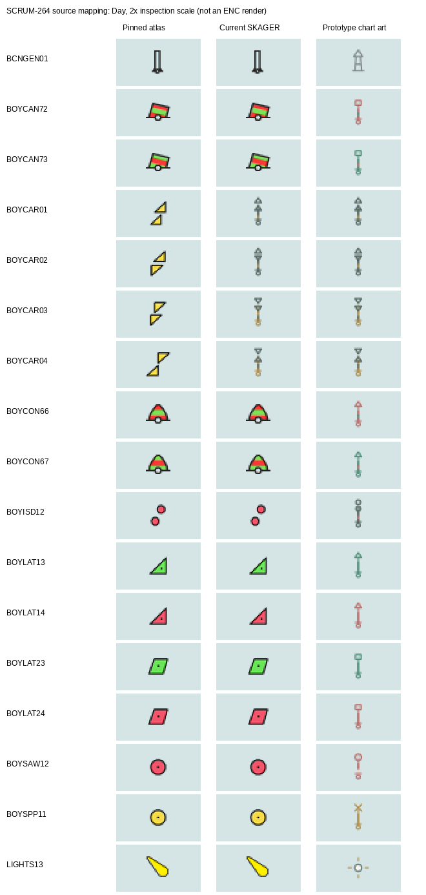

# SCRUM-264: supplied buoy, beacon and light artwork mapping

This is a read-only design/source audit of `a3e84771652c920479517f0d16a1dd6133c440d2`, not an implementation or acceptance claim. Jira SCRUM-264 was read in its actual High / Pågående state. No source resource, prototype, frozen build or chart profile changed.

**The user's observation is supported by the assets:** current SKAGER substitutes the four cardinal buoy glyphs, but the other explicitly designed lateral, isolated-danger, safe-water, special-buoy, beacon and light-point artwork still has stock silhouettes. Neutral recoloring cannot complete those designs.

This is an inspection contact sheet, not an ENC render. It compares the pinned stock atlas, actual a3e8477 derived Day atlas, and exact `chartSymbolGraphic` output from the immutable package at 2× inspection scale. Entries are centered for comparison, not geographically anchored. The right column uses 27/32 for ordinary points and the actual chart's **25/32 for LIGHTS13**. Full generated SVG fragments are in `prototype-artwork.json`.

## Which supplied assets are authoritative

`SYMBOLS.md` distinguishes two layers:

- The complete atlas retains original upstream source glyphs (1,018 points, 59 lines, 30 patterns). `symbol-library.mjs` deduplicates by **last definition per name and geometry**, and `symbol-catalogue.json` carries crop/pivot metadata. Merely importing this atlas would retain the stock appearance the user rejected.
- The map's modern art is explicitly authored in `src/chart-marker-art.js`, using `src/seamarks.json` for family/color/head data, `src/chart-symbols.js` for point scale/upright behavior, and the final `src/chart-symbols.css` / embedded `index.html` cascade. `chart-symbols.json` supplies illustrative instances, never production positions.

`mapping.json` verifies **15 immutable files** against `prototype-original.json`, records full hashes, matches all **17 explicitly designed buoy/beacon/light effective XML nodes** to the pinned application library, and enumerates **784 related marine/inland/topmark/landmark lookup rows** with exact attributes, instructions, display/radar priorities and tables.

The package vendor source is OpenCPN `1bf728e17feaae05fddad3aad5be677e15c1e89c`; our application stays pinned to `37fd0cddb7334fe489e9f18aa163977a9c5c84f7`. Their complete XML hashes differ (`66d2dffa…` versus `84f93522…`), but these 17 effective nodes match byte-for-byte after XML parsing, and **all three original raster sheets are byte-identical**. There is no need to import the other upstream revision. Package `vendor/opencpn/COPYING` / `SOURCE.json` retain GPL-2.0 attribution; modern paths and physical illustrations are identified by the package as original prototype work. Preserve those provenance records in any derivatives.

## Complete family map and gaps

Counts are exact uppercase marine Point-table lookup rows; the machine map also records lowercase/inland users and other table types. A symbol name alone is not a class selector.

| Family | Pinned selection | Explicit modern package asset | Current state and bounded gap |
| --- | --- | --- | --- |
| Lateral, red/green cone | Simplified BOYLAT, color 3/4 plus BOYSHP1 or CATLAM2; ids 1037/1038/1043/1044 | BOYLAT14 red / BOYLAT13 green | Stock triangles remain. Use exact color/shape selected by lookup; never infer IALA region from geography. |
| Lateral, red/green can | BOYSHP2 or CATLAM1; ids 1039/1040/1041/1042 | BOYLAT24 red / BOYLAT23 green | Stock quadrilateral bodies remain. Same exact lookup boundary. |
| Preferred/banded lateral | Simplified ids 1029–1036, COLOUR3,4,3 or 4,3,4 with shape/category | BOYCON66 red-green-red, BOYCON67 green-red-green; BOYCAN72 red-green-red, BOYCAN73 green-red-green | Pinned Simplified uses ordinary BOYLAT glyphs, while the prototype has distinct banded stems. Requires exact lookup-specific derived symbols, not global four-glyph replacement. |
| Cardinal buoy N/E/S/W | CATCAM1/2/3/4, Simplified ids 1022–1025 / RCID31074–31077 | BOYCAR01/02/03/04, effective RCID1270–1273 | Already derived by SCRUM-256. Its proof covers these four only; unknown id1026 remains BOYDEF03. Paper has 37 body lookups and stays distinct. |
| Isolated-danger buoy | Simplified id1028 / RCID31080 | BOYISD12, effective RCID2049; two spheres, black-red-black stem | Stock two red-circle glyph remains. Exactly one direct user. Paper's 15 body rules are separate. |
| Safe-water buoy | Simplified id1046 / RCID31098 | BOYSAW12, effective RCID1294; one sphere, red/white stem | Stock red-circle glyph remains. Exactly one direct user. The modern drawing uses sequential stem segments; do not reinterpret that illustration as evidence of physical stripe orientation. Paper has 13 rules. |
| Special-purpose buoy, mapped style | Simplified ids1051/1052/1057/1058/1059/1060/1062/1064 | BOYSPP11, effective RCID1297; yellow X/stem | Eight exact users. Other Simplified branches use BOYSPP15/25, BOYSUP02 or BOYDEF03 and have no explicitly mapped modern counterpart. Paper has 57 shape/color rules. |
| Cardinal beacon | Simplified ids965–968 / RCID31017–31020 choose BCNCAR01–04 | No explicit BCNCAR modern artwork | Do not reuse floating BOYCAR bodies indiscriminately. Five Simplified /14 Paper rules including unknown fallback are distinct. |
| Lateral beacon | COLOUR, BCNSHP and CONVIS choose BCNLAT15/16/21/22, BCNSTK02, CAIRNS01/11 or BCNDEF13 | No explicit classified modern assets | 33 Simplified /37 Paper rules. Generic beacon art cannot erase red/green, stake/tower/cairn or preferred-band distinctions. |
| Isolated-danger beacon | Simplified id970 selects BCNISD21 | No explicit modern asset | One Simplified /8 Paper rules; distinct fixed mark and topmark composition. |
| Safe-water beacon | BCNSHP branches select BCNSAW13/21 | No explicit modern assets | Seven Simplified /8 Paper rules. Keep fixed-platform distinction. |
| Special beacon | BCNSPP13/21, CAIRNS01/11, NOTBRD11, BCNDEF13 | No direct modern mapping for these | Eleven Simplified /43 Paper rules; category/notice-board/cairn exceptions cannot become one icon. |
| Generic beacon | Effective BCNGEN01 RCID11, last of two definitions | Exact small open beacon path in chart-marker-art.js | Has **21 direct users**, including marine Paper bodies and `_bcngn` / `_slgto` Simplified/Paper. Global replacement can affect composed physical TOPMAR positions. Requires a separate bounded composition proof or owned per-lookup alias. |
| White/yellow/orange short-range non-sector light | LIGHTS05→LIGHTS06→`_selSYcol`; known color 1/6/9, nominal range <10 (default9), no sectors | LIGHTS13 effective RCID1398 | Final prototype is **a circle with four rays, not a lighthouse tower**. Current atlas remains a yellow flare. A scoped exact LIGHTS13 raster derivative is the smallest resource-only light correction; it does not cover every LIGHTS object. |
| Red/green non-sector light | `_selSYcol` chooses LIGHTS11 / LIGHTS12, including supported white/red and white/green combinations | No explicit mapped red/green light-point assets | Could derive the same supplied point geometry with separately approved color-preserving rays, but that is an explicit extension, not a supplied one-to-one asset. Do not make them all yellow. |
| Unknown/special lights | LITDEF11; CATLIT8/11→LIGHTS82, CATLIT9→LIGHTS81; directional missing-orientation→QUESMRK1 | No explicit modern counterparts | Preserve these distinct unavailable/special cases. |
| All-round or sector LIGHTS | Range≥10 / full-round and real SECTR1/2 generate CA commands, not LIGHTS13 | Prototype fictional sector instance uses point plus illustrative arcs | Changing LIGHTS13 will not style those circles/sectors. Preserve real bearings, nominal-range decisions, obscured sectors and leg geometry. Never copy the prototype's 44/340 mock radii or bearings. A later point-only addition requires a carefully guarded renderer/conditional hook and matching private-adapter port. |
| Light float / light vessel | LITFLT02 / LITVES02 Simplified; three Paper rules each | No explicit modern map assets | Floating light-platform classes must not become shore lighthouses. |
| Lighthouse physical structure / landmarks | LNDMRK CATLMK/CONVIS/etc chooses TOWERS*, other landmark bodies; independent LIGHTS may co-locate | No explicit modern TOWERS* mapping | The package's LIGHTS13 point is not permission to replace every tower/building or remove the underlying structure. A stock-looking tower can be an independently classified landmark. |
| TOPMAR and physical equipment | Default Simplified id1262 blank; exceptional TOPSHP15/16 still drawn; Paper invokes TOPMAR01 and has 81 rows | Guide heads are family illustrations | Keep all real topmark rules. `TOPMAR01` explicitly chooses rigid versus floating glyphs by co-location, with coordinated body/topmark positioning. Do not add inferred physical equipment to Paper mode. |
| Emergency wreck, unknown marks, national/inland variants | Provider-specific/default/inland branches | Emergency entry is explicitly a physical illustration with **no chart glyph/code** | No designed chart asset exists for these. Preserve supported provider portrayals and unknown markers, not reference pins or invented symbols. |

Full Paper symbol sets, all exact RCIDs and the lowercase/inland rows are indexed in `mapping.json`, rather than omitted or collapsed into one representative glyph. The four ordinary lateral resources also have lowercase `boylat` users (including inland CATLAM7/8), so even a visually correct global replacement would exceed a marine-only first slice.

## Practical first implementation boundary for review

1. **Complete the mapped Simplified marine buoy art.** Add source-locked private atlas derivatives of the four ordinary lateral and four banded/preferred paths; redirect only uppercase BOYLAT ids1029–1044 to those owned symbols. This preserves the sixteen exact color/shape/category selectors and text/priority/order, while avoiding changes to lowercase/inland or Paper consumers. Use each banded lookup's actual shape/color sequence to select the corresponding BOYCAN72/73 or BOYCON66/67 design.
2. Derive the three exclusive mapped Simplified glyphs BOYISD12, BOYSAW12 and BOYSPP11 through the existing proven unused-tile mechanism, guarded by their exact node identities and complete direct-user sets. Keep all remaining special-purpose, unknown and physical Paper variants unchanged and explicitly unclaimed. Keep the existing four cardinal derivatives and their source tests.
3. **Add the exact final LIGHTS13 point artwork** (25/32, 3.5-unit circle, four 7→10-unit rays, actual floating/chart-text/yellow roles), with a centered pivot at the existing object's projected coordinate and enough transparent tile extent. Keep its existing conditional selection, all CA sectors, text, ranges, red/green/unknown/special light branches and independent structures unchanged. Raster `RenderSY` reaches the existing software/GL raster path; the raster implementation does not apply its supplementary `rot_angle` parameter, so this does not require a generic rotation override.
4. Review generic BCNGEN01 and classified beacon extensions separately with their full co-located topmark composition. The exact generic artwork is available, but applying it indiscriminately to the classified rows above would lose meaning. This is a concrete remaining mapping/design boundary, not a claim that neutral recoloring fulfilled the user request.

Use immutable SVG paths, final CSS (1.3 round stroke, family colors, .13 head fill, stem width1.6, water-filled base circle) and one Night chart brightness `.78`. The prototype's chart-sized glyphs remain upright; preserve geographic object coordinates and explicit new raster pivot/bounds. Retain upstream chart-scale/DPI settings; do not introduce a separate guessed mark sizing preference.

## Required focused proof after authorization

- Literal source hashes and catalogue effective-node/crop equality; exact generated SVG/RGBA for each approved family/color combination and all three themes.
- Exact lookup-positive cases for the sixteen marine lateral selectors and complete negative users: Paper, lowercase/inland, unknown/missing attributes and unrelated marks. Reverse only approved SY token changes/owned symbol nodes/atlas tiles, then require whole-resource equality.
- Preserve band order, head class, daylight color distinctions and all topmark/priority/text/lookup ordering. Demonstrate atlas non-overlap, alpha, geographic pivots and dirty bounds; do not globally recolor CHRED/CHGRN/LITYW or replace OUTLW.
- For LIGHTS13, test the actual conditional boundary: short white/yellow/orange versus red/green, unknown, special CATLIT, directional, all-round and sector branches; no modified sector strings or parameters. Verify actual software and GL raster composition at the geographic point.
- Batch actual representative ENC captures and native Windows proof after the selected implementation. Current Seattle fixture is not full-family coverage and has no cardinal CATCAM objects. Boat recognition/readability remains open.

No production edits are proposed outside those reviewed boundaries, and none have been made in this audit.
