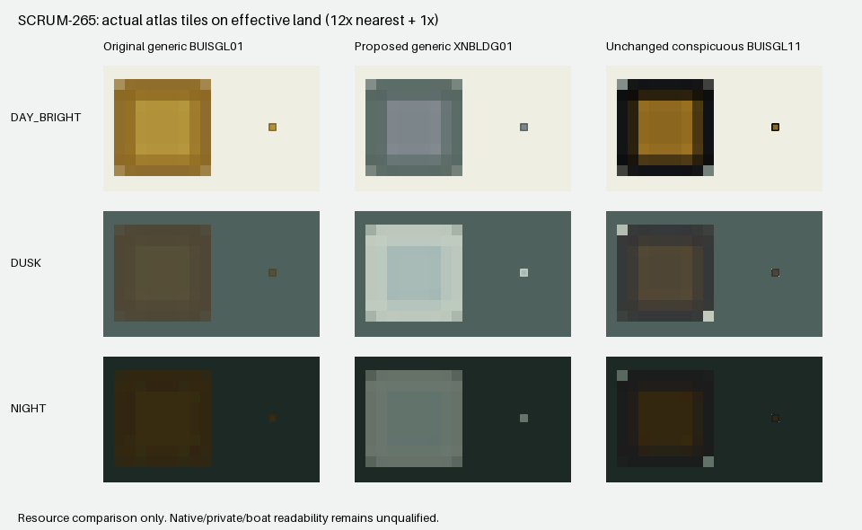

# SCRUM-265: isolated generic building point

Implementation based on `46237a4`, in the isolated `scrum265-building-point`
worktree. This is resource-generation evidence, not a chart-canvas or native
acceptance result. The sealed 5bb Linux application and current native candidate
were not modified or launched.

The [source audit](../scrum265-lighthouse-building-audit/README.md) identifies the
observed island square as BUISGL RCID36, without CONVIS or function attributes.
Only the complete pinned Simplified default lookup 1091/31143 is redirected from
`SY(BUISGL01)` to `SY(XNBLDG01)`. Absence of CONVIS is not treated as an affirmative
inconspicuous classification. All selectors, category, priority and visibility
remain exact. Paper 2021/30292, explicit CONVIS1, function-specific rules, original
BUISGL01/BUISGL11, global CHBRN/LANDF and all HPGL geometry remain unchanged.

The alias retains the 9×9 rectangle, pivot (4,4), all 81 source alpha bytes and
the original vector geometry/pen identities. RCID60016 and XNBLDG01 are unused
in the original/effective dictionary. Its rectangle (788,1160,9,9), including a
two-pixel moat, intersects no declared bitmap and is transparent in all three
pinned and prior generated sheets. Generation checks these boundaries again.
Only the new 81 pixels per theme may differ from the prior generated sheets.

The supplied prototype has no dedicated building artwork. The approved mapping
uses its generic service fill and neutral black outline as two isolated colors
XNBLF/XNBLO. Night brightness 0.78 is applied once. This is a role mapping, not a
claim that the prototype supplied this square.

| Theme | Fill RGB | Outline RGB |
|---|---|---|
| Day | 124,133,138 | 83,100,95 |
| Dusk | 168,187,183 | 195,206,194 |
| Night | 98,115,108 | 107,119,109 |

The source-locked recipe derives one signed rational transfer weight per pixel
from the exact Day tile's known LANDF/CHBRN two-pen line. Denominator 3969 and
numerators −376…4521 preserve baked filter overshoot instead of clamping it or
classifying pixels by hue. Reconstructing the original Day RGB from that line
differs by at most one rounded channel level (29 of 243 channels). The differently
baked Dusk/Night RGB is not mistaken for current XML palette values; all three
source alpha masks are identical, and the same geometry weights transfer the two
new theme inks. Exact tile hashes, complete source symbol/lookup hashes and the
recipe hash reject source drift. `tools/derive-building-point.py` reproduces the
committed recipe byte-for-byte, SHA256
`0d5dfa911e9aec2c244249e6d38934852aa293302b9ac8ff6841cce9fa071145`.

This comparison uses the actual prior-generated/new/conspicuous atlas pixels on each
effective land color, at 12× nearest enlargement and 1×. It is not a chart
render. Dusk/Night generic ink is brighter than the unchanged baked conspicuous
tile; the conspicuous symbol retains its dark outline and brown fill. Both are
filled squares. Native readability and recognition of the distinction remain
open; no universal contrast or all-screen conformance claim is made.

The initial `pinned-source-comparison.png` used the original pinned conspicuous
tile. A final assertion exposed two already-recolored neutral pixels per theme
in prior generated BUISGL11. The corrected main comparison uses the actual
sealed prior/effective tile and checks exact equality with it. The new alias
changes none of those pixels; see `comparison-crosscheck.log`.

## Focused verification

- Generator passed its pinned-source and whole-resource validation.
- 128 focused checks passed, including full prior-atlas RGBA inverse and
  canonical XML inverse: remove only the alias, two colors and lookup redirect
  and the prior generated resources are restored. PNG encoding/whitespace need
  not be byte-identical; image pixels and normalized XML are exact.
- Negative controls reject source RGB/alpha drift, changed alias alpha,
  occupied tile/moat pixels, overlap declarations, changed source selectors or
  symbol geometry, Paper/CONVIS/function redirects, classification/category/
  priority changes, alias pivot/size/HPGL/pen-role changes and duplicate aliases.
- Original vector subtree is identical; only its two color-name bindings change.
  This proves geometry/color-binding parity, not execution of an HPGL painter.
- Recipe reproduction, Python syntax checks and `git diff --check` passed.
- Existing integrated resource inverse tests are extended precisely; the real
  loader fixture has a separate 9×9/pivot (4,4)/81-alpha check, preserving all
  existing 24×28 checks. Those combined suites/C++ loader were not rerun here.

See `checks.log`, `recipe-reproduction.log` and `inputs-outputs.json`. The focused
command and exact prior resource identity are retained in the receipt. Full
generated artifacts remain at `.local/building-point/generated` in this worktree.

The existing private adapter preparation copies and verifies every generated
manifest file plus its header; no private painter or source patch is added.
Helper/recipe configuration dependencies and exact native input closure include
the new sources. Remaining gates: parent-reviewed actual Linux canvas, native
Windows software/GL/theme/DPI behavior, private adapter rendering, and boat
display/recognition. No new application build, CI, producer, package or hardware
action was performed for this change.
