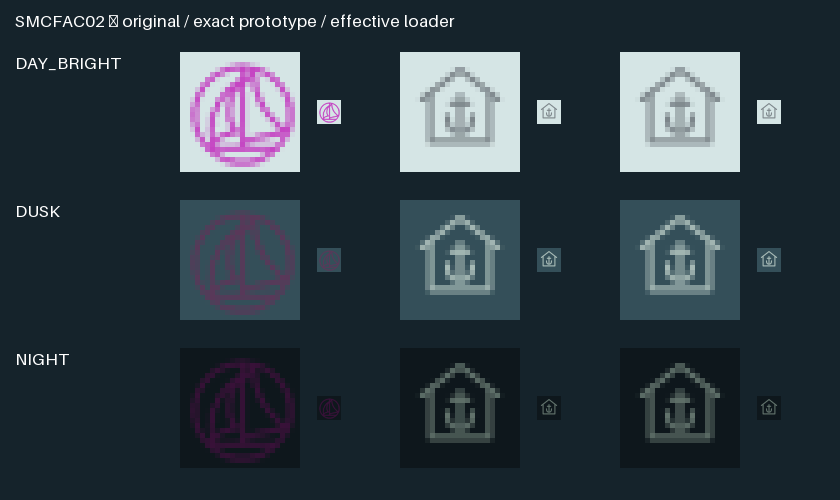

# SCRUM-279: exact supplied marina service artwork

Isolated increment based on `48c2f8b8d5d4103bcbaacc45a18c4e6a238d4c52`.
The frozen 4ddf1f3 candidate does **not** contain this change. No application
build, CI dispatch, chart canvas or boat action occurred.

Only effective **SMCFAC02 / RCID2108** receives the immutable prototype's
roof-and-anchor path. The existing service-art helper now includes this third
symbol; no renderer or new class/category selection is introduced. Stock
Standard/Legacy resources and the original bitmap/vector are untouched.

## Exact source and meaning

Pinned OpenCPN is `37fd0cddb7334fe489e9f18aa163977a9c5c84f7`. Its
`data/s57data/chartsymbols.xml:37319` contains exactly one SMCFAC02 definition,
described as “yacht harbour, marina.” Although its definition says V, it has
a bitmap and no `prefer-bitmap=no`; actual `ChartSymbols::BuildSymbol` selects R.
The unchanged pinned loader methods execute in the retained fixture.

All ten direct consumers are recorded with complete attributes, instructions,
priority, table and hashes in `consumers.json`:

| Class | Tables | RCIDs | Existing selection |
|---|---|---|---|
| HRBFAC | Plain / Symbolized / Simplified / Paper | 32113 / 32452 / 31179 / 30374 | CATHAF5 |
| SMCFAC | Plain / Symbolized | 32225 / 32566 | Generic area fallback |
| hrbare | Plain / Symbolized | 32295 / 32642 | cathbr3 |
| hrbfac | Plain / Symbolized | 32304 / 32651 | cathaf5 |

No direct conditional C++ consumer occurs in pinned libs/gui/model. Existing
area fills, boundaries, labels, display/radar priorities and fallback decisions
are unchanged. The earlier source audit deferred this symbol because generic
SMCFAC area lookup selection does not assert a physical building. SCRUM-279
explicitly selects the supplied **named service glyph**: the roof/anchor is a
service-class depiction, never an inference about surveyed construction. This
change does not restyle unrelated marina or harbor symbols or alter global
CHMGD, CHBRN or LANDF. Generic/inland recognition still requires actual review.

## Artwork, atlas and anchor

`docs/design/prototype/src/chart-marker-art.js` supplies the exact path, also
present unchanged in final `index.html:1207`. Final `syncChartSymbols` calls
`chartSymbolGraphic(...,27)` for SMCFAC02; its `27/32` transform cancels map zoom
through the containing reciprocal scale. Final service CSS uses fill none,
stroke 1.3, round caps/joins and geometricPrecision. Thus the native base ink
width is 1.096875 pixels, preserving existing upstream symbol/user/DPI scaling.
Day/Dusk service RGB is (124,133,138)/(168,187,183); Night (126,148,138) receives
the prototype's .78 brightness once, giving (98,115,108). No additional opacity.

The exact SVG and locked 24×24 coverage were generated with rsvg-convert 2.62.3,
matching the existing service rasterizer. The new tile is (820,1160,24,24) with
pivot (12,12), versus original (940,239,21,21), pivot (10,10). The exact path is
translated by the new pivot before rasterization: local (0,0) stays the same
geographic anchor, not the asymmetric artwork bounds' center. Upstream scalar
and rotated anchor subtraction remain unchanged, including their existing
fractional-scale integer rounding. No resampling to fit the old bounds occurs.

Generation rejects overlap against every declared bitmap, previously allocated
anchor/service/cardinal/seamark tile and the new tile's two-pixel moat. Every
pixel in that tile/moat is transparent in the prior three atlases; dimensions
remain 1500×1200. Exactly **152 pixels per theme** change. The old tile, invisible
RGB, all neighboring pixels and every other existing glyph remain identical to
the previous generated resources. Only six numeric bitmap attributes change;
restoring them yields identical parsed XML, including all lookups and vectors.

Each row shows 5× nearest enlargement plus native 1× samples on the exact deep
water fill. The original sailboat/circle becomes the supplied roof/anchor.
The reference and effective loader shapes match without clipping; service ink
is muted in Day and visible in the inspected Dusk/Night samples. These are
glyph comparisons, not acceptance of all backgrounds, scale factors or actual
chart readability. The Night sample is deliberately dimmer than Dusk.

## Focused checks

- **4,376 checks passed**: prior/current complete RGBA inverse, exact ten-consumer
  identity, all old XML/rules restored, prototype geometry/coverage/style,
  effective bitmap metadata, scaled/rotated hotspot and rejected mutations of
  instructions, category, selector, preference, pivot, dimensions and overlap.
- **15 negative controls passed**: altered source SVG/mask, occupied pixel/moat,
  declared-resource or existing-anchor/service collision fail closed.
- **9,350 actual pinned loader checks passed**: ProcessSymbols/BuildSymbol,
  theme PNG loading, GetImage and GetGLTextureRect execute for all three service
  glyphs. The independent freshly rasterized SVG coverage matches loaded alpha;
  actual crops are retained. Fixture owner containers are substituted; no GL
  context/draw, complete chart canvas or private plugin initialization occurs.
- Both previous/current resource generators succeeded with pinned original
  bytes and their existing complete XML semantic guard. The previous baseline
  used the unchanged 48c2f8b helper. The full broad resource suite was not run.

Existing broad inverse checks were extended by exactly the new tile/metadata;
their original golden values and guards remain intact. CMake regeneration lists
both new assets explicitly. Existing Windows resource inventory scans the full
resources/chart-style tree, so the new inputs enter its exact identity closure.
No package/verifier trust boundary is weakened.

`receipt.json`, `generated-resources.json`, `loader.json`, original focused logs
and image hashes identify the inputs/outputs. Full generated atlases and the
prior baseline remain local under `.local/marina/`. Native Windows, actual
software/GL ENC canvas, private renderer and boat evidence remain open.
