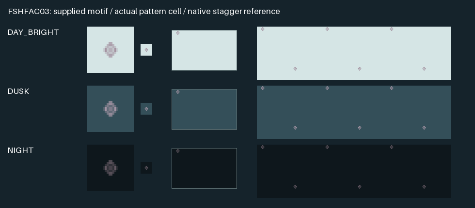

# SCRUM-282: supplied fishing-stake area motif

Isolated increment on `48c2f8b8d5d4103bcbaacc45a18c4e6a238d4c52`; it is **not**
in frozen candidate 4ddf1f3. No application build, full suite, CI dispatch or boat
operation occurred. This evidence covers resources, actual loader methods and
the actual pattern-buffer conversion, not polygon drawing or native acceptance.

## Exact selection and artwork

Only Plain FSHFAC area lookup **id65 / RCID32101 / CATFIF1** changes from
`AP(FSHFAC03);LS(DASH,1,CHGRD)` to `AP(XNFISH03);LS(DASH,1,CHGRD)`. All other
lookup attributes, category/priority, visibility, polygon and boundary remain
unchanged. The stock **pattern FSHFAC03 / RCID2001** remains exact. Its separate
**point symbol FSHFAC03 / RCID2067** and SY lookups405/1115/2182 are untouched.

The unique pattern alias **XNFISH03 / RCID60017** prevents the shared loader
graphics-location dictionary from confusing it with the later same-name point
symbol. It retains the stock vector/HPGL, vector bounds, origin, pivot, spacing
and stagger as a fallback. `prefer-bitmap=no` keeps those vector metrics active.
Its separate 24×24 source-art bitmap is at (948,1160), pivot(12,12), with two-pixel
transparent moat. This does not overlap the separately reserved marina820 or
hazard852/884/916 tiles; all existing declared rectangles and pixels are checked.

The SVG repeats the immutable `chart-marker-art.js` path verbatim:
`m0-7 6 7-6 7-6-7ZM-6 0H6M0-7V7`. Final `index.html` calls the pattern artwork
with size17, hence scale17/32: aspect-preserved 6.375×7.4375 nominal geometry,
stroke1.3×17/32, round caps/joins, no fill and geometricPrecision. The sample
six-copy rectangle is **not** used as chart geometry or repetition spacing.
Final area RGB is Day(156,134,150), Dusk(184,160,177), Night(113,99,110) after
applying .78 once. Decorative rectangle opacity and dashed outline do not alter
the actual AP glyph or retained native boundary.

Locked rsvg-convert2.62.3 coverage has48 nonzero pixels. Generation adds only
those48 pixels per theme; atlas dimensions remain1500×1200. Reversing the alias,
one AP name and those pixels restores the entire previous generated XML/RGBA,
including every original point, pattern, neighboring pixel and invisible RGB.
All original standard resources and S52RAZDS.RLE remain byte-identical.

## Why a narrow pattern-cell branch is necessary

Pinned `ChartSymbols::BuildPattern` preserves vector604×151, origin(3135,2173),
pivot(4643,2168), minDist2000/maxDist10000, fillTypeS and spacingC. The actual
`s52plib::CreatePatternBufferSpec` expands bounds to include that pivot, adds
minDist on both axes, divides by `float fsf=100/canvas_pix_per_mm`, then truncates
and adds1. Thus cell dimensions derive from **3508×2156** source units. A direct
bitmap substitution bypasses this calculation and changes repeat density.

The small core/private hook runs only for the existing verified-presentation
instance flag and exact owned alias identity/metrics. It composes the atlas
motif into a transparent image using that **same original cell calculation**.
It excludes only this successfully composed image from the stock vector color
threshold filter, preserving antialias alpha. The remaining raster-to-buffer
conversion, POT allocation and outer renderers are unmodified. Disabled style,
wrong name/RCID/classification/metrics, invalid source image, nonfinite/unsupported
ppmm, excess inset or unsafe dimensions decline to unchanged stock HPGL behavior.

The original motif centre is (3437,2248.5) in source units, hence
`(302/fsf+1,80.5/fsf+1)` in the cell. The replacement stays there, subject to
nearest pixel placement and the **minimum** inset needed to keep all nonzero
coverage. The inset is bounded by `ceil(ppmm/(96/25.4))`, one nominal96DPI pixel
scaled and rounded up; it is not a claimed surveyed stake position. The alias
is never recentered in the large repeat cell, stretched to604×151, or cropped.
Sprite scaling is uniform, following the original physical ppmm factor, with
the supplied17/32 size at96DPI. Unreasonable ppmm(<1 or>24), tile dimensions or
inset decline rather than allocating an unbounded new image.

| ppmm / nominal DPI | Cell | Original centre | New centre | Inset x,y | Positive-alpha bounds, inclusive |
|---|---|---|---|---|---|
| 3 / upstream default | 106×65 | 10.06,3.415 | 10.5,4.5 | 0,1 | 7,0–13,8 |
| 96/25.4 /100% | 133×82 | 12.4142,4.04252 | 12,5 | 0,1 | 8,0–15,9 |
| 120/25.4 /125% | 166×102 | 15.2677,4.80315 | 15,7 | 0,2 | 9,0–20,13 |
| 144/25.4 /150% | 199×123 | 18.1213,5.56378 | 18,8 | 0,2 | 10,0–25,15 |

All three themes have these same bounds. The initial fixed-one-device-pixel
interpretation correctly declined125% after96% passed; its failed log remains
in `initial-one-pixel-failure.log`. The final approved DPI-scaled cap above
preserves all interpolation coverage; no alpha threshold or tolerance was
loosened. Other DPI values still require qualification and may use stock fallback
when the bounded inset cannot accommodate their resampled coverage.

The left samples show4× and1× source coverage on the exact water fill; the middle
is the actual cell at96DPI. The right is an explanatory half-cell stagger diagram
assembled from that cell, **not** an actual polygon/GL capture. The small diamond
and cross are visible in all three inspected samples, but full-chart recognition
and safety/legibility acceptance remain open.

## Focused proof and limits

- **340 resource checks passed**: source geometry/theme, unique namespace,
  original pattern/point and all SY consumers, full prior-resource inverse and
  rejection of changed category/table/instructions, spacing/pivot/bounds,
  source art, overlapping declaration and occupied pixel/moat.
- **1,048,104 assertions passed** in the actual loader/cell fixture, principally
  pixel comparisons, not a million distinct tests. It executes pinned
  ProcessPatterns/BuildPattern/ProcessSymbols, image/rectangle loading and the
  complete corrected CreatePatternBufferSpec. The core/private cell bodies are
  byte-identical; five relevant private loader methods independently match.
  Twelve theme/ppmm combinations each exercise software/POT and channel-order
  arguments; every alpha and RGB byte and blank POT padding is checked, with
  original cell sizes/stagger/phase compared side-by-side. The fixture also
  rejects mutated rule fields and confirms disabled-style stock fallback.
- The whole final core/private `s52plib.cpp` patches apply to independently
  identified original source. `source-proof.json` records hashes showing both
  outer RenderToBufferAP and RenderToGLAP_GLSL bodies remain exactly unchanged.
  The loader fixture substitutes owner containers and records HPGL invocation;
  it does not claim to execute the stock HPGL painter, GL context or full chart.
- Existing broad XML/pixel inverse guards now account for just this new alias
  and tile. CMake resource dependencies, native resource-input inventory and
  private corresponding-source header closure include the new owned files.
  No broad suite was rerun.

Native software/OpenGL polygon rendering, actual private DLL rendering, Windows
and boat review remain required. Stock repetition, half-row stagger and outer
polygon anchoring are preserved; only the measured motif inset is intentional.
